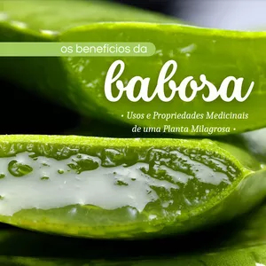

## **Introdução**

A **babosa**, também conhecida cientificamente como **Aloe vera**, é uma planta suculenta que tem sido valorizada por suas propriedades medicinais por milênios. Originária da Península Arábica, a babosa é agora cultivada em climas tropicais e subtropicais ao redor do mundo, sendo amplamente reconhecida por suas folhas grossas e gelatinosas, que abrigam um gel transparente repleto de benefícios para a saúde e beleza.

Historicamente, a babosa foi uma das plantas medicinais mais amplamente utilizadas nas antigas civilizações do Egito, Grécia e Roma. **Cleópatra** e **Nefertiti**, rainhas do antigo Egito, são conhecidas por terem usado o gel de babosa como parte de seus regimes de beleza. Na medicina tradicional, a babosa tem sido utilizada para tratar uma variedade de condições, incluindo queimaduras, feridas e problemas digestivos, graças às suas propriedades cicatrizantes, anti-inflamatórias e laxativas.

Nos dias de hoje, a babosa é frequentemente utilizada em uma infinidade de produtos de cuidados com a pele e cabelo, devido à sua capacidade de hidratar, acalmar e reparar a pele. **Estudos científicos** têm mostrado que o gel de babosa pode ser eficaz na redução da inflamação da pele, tratamento de queimaduras solares, e até mesmo na promoção da saúde bucal quando usado como um enxaguante bucal.

Além de seu uso tópico, a babosa também é consumida internamente, onde pode ajudar na melhoria da digestão e na promoção da saúde do sistema imunológico. Seja aplicada externamente ou ingerida, a babosa continua a ser uma **superestrela** no mundo da saúde natural e bem-estar, sendo uma adição valiosa a qualquer rotina de cuidados pessoais.

### **Benefícios da Babosa para a Pele**

A **babosa** é amplamente reconhecida por seus efeitos benéficos na pele, sendo um ingrediente comum em muitos produtos dermatológicos devido à sua capacidade de tratar **queimaduras, cortes e irritações**. O gel encontrado dentro de suas folhas suculentas contém compostos como glicoproteínas e polissacarídeos, que são conhecidos por suas propriedades calmantes e cicatrizantes. Esses componentes ajudam a reduzir a dor e a inflamação, acelerando o processo de cura da pele.

Para queimaduras leves, incluindo queimaduras solares, aplicar gel de babosa diretamente sobre a área afetada pode proporcionar alívio imediato, reduzindo a vermelhidão e o desconforto. O gel também forma uma barreira protetora que ajuda a manter a umidade e impede a entrada de bactérias, promovendo assim um ambiente ideal para a regeneração da pele. Da mesma forma, para cortes e arranhões, a babosa pode ser aplicada como um **antisséptico natural**, protegendo a ferida enquanto estimula a cicatrização.

Incorporar a babosa em **rotinas de cuidados com a pele** pode ser extremamente benéfico, especialmente para aqueles com pele seca ou condições inflamatórias como eczema e psoríase. O gel da babosa é um excelente hidratante devido à sua rica composição em água e pode ser usado diariamente sem causar obstrução dos poros. Para aqueles que lutam contra a acne, a babosa oferece benefícios anti-inflamatórios e antibacterianos que ajudam a reduzir o inchaço dos poros e a limpar as bactérias causadoras de acne.

Além disso, muitas pessoas criam suas próprias **máscaras faciais** de babosa em casa, misturando o gel com outros ingredientes naturais, como mel, óleo de tea tree ou iogurte, para criar tratamentos de pele personalizados. Essas máscaras podem ajudar a acalmar, hidratar e revitalizar a pele, deixando-a fresca e rejuvenescida. Seja utilizada pura ou como parte de um regime de cuidados com a pele mais amplo, a babosa é um poderoso aliado na manutenção da saúde e beleza da pele.

### **Babosa e Saúde Digestiva**

A **babosa** é frequentemente elogiada por seus benefícios na promoção da saúde digestiva. O gel da babosa, quando consumido, pode oferecer alívio para uma variedade de problemas gastrointestinais, incluindo **azia, gases e constipação**. A presença de enzimas naturais e um alto teor de água no gel ajudam a melhorar a digestão e regular o trânsito intestinal, o que pode contribuir significativamente para o alívio da constipação e outros desconfortos digestivos.

Além disso, a babosa possui propriedades anti-inflamatórias que podem ajudar a acalmar o trato gastrointestinal e reduzir a irritação. Isso é particularmente benéfico para pessoas que sofrem de condições como **síndrome do intestino irritável (SII)** ou colite. O suco de babosa, que pode ser extraído do gel interno das folhas, tem sido usado como um remédio natural para revestir e acalmar o estômago, ajudando a proteger contra a acidez e a irritação.

No entanto, é importante adotar **precauções ao consumir babosa internamente**. O gel deve ser cuidadosamente separado da camada externa das folhas, que contém aloína, um composto que pode causar reações adversas como cólicas e diarreia se consumido em excesso. Além disso, o consumo interno de babosa não é recomendado para mulheres grávidas, lactantes ou pessoas que estão tomando certos medicamentos, devido a possíveis interações medicamentosas.

**Recomendações de consumo** sugerem começar com pequenas quantidades de suco de babosa para garantir que não haja reações adversas. Consultar um profissional de saúde antes de começar a usar babosa para tratar condições digestivas também é aconselhável, pois eles podem oferecer orientação sobre a dosagem adequada e possíveis interações com outras condições de saúde ou tratamentos. Assim, enquanto a babosa pode ser um auxílio eficaz para a saúde digestiva, seu uso deve ser cuidadoso e bem informado.

### **Babosa no Tratamento Capilar**

A **babosa** tem uma longa história de uso no tratamento capilar, valorizada especialmente por sua capacidade de nutrir o couro cabeludo e estimular o crescimento dos cabelos. O gel de babosa contém uma rica matriz de nutrientes, incluindo vitaminas, minerais e aminoácidos, que são essenciais para a saúde do cabelo. Estes nutrientes ajudam a hidratar o couro cabeludo e fortalecer os fios, reduzindo a quebra e promovendo um crescimento saudável.

Um dos principais benefícios da babosa para o couro cabeludo é sua propriedade antifúngica e antibacteriana, que ajuda a combater a caspa e outros problemas de couro cabeludo relacionados a microrganismos. A aplicação regular de gel de babosa pode aliviar a coceira e a descamação, mantendo o couro cabeludo limpo e hidratado. **Acalma o couro cabeludo irritado**, criando um ambiente melhor para o crescimento do cabelo.

Além de seu uso direto, a babosa também pode ser incorporada em **máscaras capilares caseiras**. Uma receita popular é misturar gel de babosa com óleo de coco e uma gota de óleo essencial de alecrim para criar uma máscara que promove o brilho e a saúde dos cabelos. Simplesmente aplique esta mistura no cabelo e no couro cabeludo, deixe agir por cerca de 30 minutos, e então lave com um shampoo suave.

Outra receita eficaz para fortalecer o cabelo envolve misturar gel de babosa com iogurte natural e mel. Esta combinação é rica em proteínas e antioxidantes, o que pode ajudar a reparar os fios danificados e prevenir pontas duplas. Aplique a mistura no cabelo, deixando agir por aproximadamente 20 a 30 minutos antes de enxaguar. **Estas máscaras não só melhoram a saúde capilar**, mas também deixam o cabelo macio, brilhante e visivelmente mais saudável.

### **Outros Usos da Babosa**

Além de seus usos mais conhecidos na saúde da pele e do cabelo, a **babosa** possui uma variedade de aplicações menos divulgadas que podem beneficiar significativamente nossa saúde geral. Um desses usos é na saúde bucal, onde o gel de babosa pode ser empregado como um **anti-séptico natural** para tratar gengivites e úlceras bucais. A babosa ajuda a reduzir a inflamação gengival e acelera a cura de feridas na boca devido às suas propriedades antibacterianas e cicatrizantes.

Outro uso valioso da babosa é como um **anti-inflamatório natural**. O gel contém compostos que ajudam a reduzir a inflamação e a dor associadas a condições como artrite e distensões musculares. Aplicar o gel diretamente na área afetada pode proporcionar alívio imediato, e a ingestão regular de suco de babosa também pode contribuir para efeitos anti-inflamatórios sistêmicos, melhorando a mobilidade e o conforto.

Para aqueles interessados em remédios caseiros, preparar **suco de babosa** é uma forma excelente de aproveitar seus benefícios internos. Para fazer o suco, corte uma folha de babosa e extraia o gel transparente. Misture este gel com água ou suco de frutas para melhorar o sabor. Este suco pode ser consumido para promover a saúde digestiva, aumentar a hidratação e suportar o sistema imunológico.

Além disso, a babosa pode ser utilizada para preparar uma variedade de **remédios caseiros**. Por exemplo, misturar o gel de babosa com mel e gengibre cria um potente xarope para tosse que não apenas acalma a garganta, mas também oferece benefícios antibióticos naturais. Outras combinações, como babosa e limão, podem ser usadas para fazer máscaras faciais revitalizantes ou tratamentos para o couro cabeludo, ampliando ainda mais as múltiplas funcionalidades desta planta versátil.

Descubra todos os segredos da babosa com o infoproduto **"Os Benefícios da Babosa: Usos e Propriedades Medicinais de uma Planta Milagrosa"**. Este guia abrangente explora as diversas maneiras pelas quais a babosa pode enriquecer sua saúde e bem-estar, oferecendo desde receitas caseiras até dicas detalhadas sobre como utilizar esta planta poderosa para melhorar sua vida. Acesse agora mesmo através do link [**Os Benefícios da Babosa: Usos e Propriedades Medicinais de uma Planta Milagrosa**](https://go.hotmart.com/H92556570L) e comece a transformar sua saúde com a natureza!

### **Conclusão**

Ao longo deste post, exploramos os numerosos e variados **benefícios da babosa**, desde suas aplicações na saúde da pele e do cabelo até seu uso como remédio natural para problemas digestivos e inflamatórios. A babosa, ou **Aloe vera**, é uma planta incrivelmente versátil que oferece mais do que apenas benefícios estéticos; ela possui propriedades que promovem a saúde geral, atuando como um hidratante profundo, um calmante para irritações de pele, e até mesmo como um auxílio digestivo.

Reiteramos a importância de utilizar o gel de babosa puro e corretamente preparado para evitar efeitos colaterais, especialmente quando usado internamente. As precauções são fundamentais para garantir que todos os benefícios dessa planta milagrosa possam ser aproveitados sem riscos. Além disso, a facilidade de **cultivar babosa em casa** torna-a acessível para todos aqueles interessados em integrar remédios naturais em suas vidas.

Encorajamos nossos leitores a experimentar os diversos usos da babosa. Seja incorporando o gel em sua rotina de cuidados com a pele, preparando sucos para melhorar a saúde digestiva, ou utilizando suas propriedades medicinais para aliviar pequenas queimaduras e cortes, a babosa pode ser um complemento valioso para sua **rotina de saúde e bem-estar**.

Concluímos este guia com a esperança de que você esteja agora mais informado sobre como a babosa pode servir não apenas como um tratamento natural, mas também como um elemento promotor de bem-estar em sua vida diária. Experimente, explore e, mais importante, desfrute dos benefícios que a babosa tem a oferecer.

### **FAQ**

**Qual é o tipo de doença que a babosa cura?**
A babosa não cura doenças, mas é conhecida por suas propriedades que auxiliam na gestão de sintomas de várias condições. É amplamente utilizada para tratar problemas de pele como queimaduras, cortes, irritações e acne devido às suas propriedades anti-inflamatórias e cicatrizantes. Também é usada para aliviar problemas digestivos como azia e constipação.

**Para que serve a babosa e como devo usar?**
A babosa é usada para uma variedade de propósitos que incluem cuidados com a pele, saúde capilar e alívio de problemas digestivos. Para uso tópico, aplique o gel de babosa diretamente sobre a pele para tratar queimaduras, cortes ou como hidratante. Para problemas digestivos, o suco de babosa pode ser consumido, mas com moderação para evitar efeitos colaterais.

**Como usar a babosa para tirar inflamação?**
Para reduzir a inflamação, aplique gel de babosa diretamente na área afetada. Sua natureza anti-inflamatória ajuda a acalmar a pele inflamada e pode ser benéfica em condições como eczema e psoríase. Para inflamações internas, como nas articulações, o consumo de suco de babosa pode ajudar, mas deve ser feito sob orientação médica para evitar complicações.

**Pode tomar a babosa pura?**
Embora o suco de babosa possa ser consumido para benefícios digestivos, não é recomendado tomar o gel puro sem diluição devido à presença de aloína, que pode ser irritante e causar efeitos colaterais como cólicas e diarreia. É seguro consumir o suco de babosa preparado comercialmente ou diluído em água ou outro suco de fruta, sempre observando a moderação e seguindo as recomendações de dosagem.
