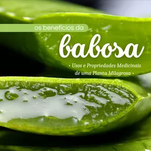

## **Introdução**

Queda de cabelo é um problema que afeta milhões de pessoas ao redor do mundo, causando não apenas perda física de cabelo, mas também impactando a autoestima. Embora existam diversas causas para esse fenômeno, desde genética até estresse, muitos estão descobrindo na **babosa (Aloe vera)** uma solução natural promissora para esse desafio.

A **babosa** tem sido usada por séculos em várias culturas para a manutenção da saúde e beleza, mas recentemente, seu uso em tratamentos capilares tem ganhado popularidade. Isso se deve aos seus ricos nutrientes e propriedades que ajudam a nutrir o couro cabeludo e fortalecer os fios, combatendo a queda de cabelo de maneira eficaz.

Este suculento remédio natural contém uma vasta gama de vitaminas, minerais e enzimas que promovem a saúde do couro cabeludo e o crescimento dos cabelos. Estudos recentes têm mostrado que a aplicação regular de gel de babosa pode ajudar a reduzir a queda de cabelo e até mesmo estimular o crescimento de novos fios.

À medida que mais pessoas procuram alternativas naturais para os cuidados com o cabelo, a babosa se destaca como uma opção valiosa e acessível. Este post explorará como você pode utilizar a babosa para tratar a queda de cabelo, aproveitando ao máximo suas propriedades benéficas sem recorrer a tratamentos químicos caros e potencialmente prejudiciais.

### **Seção 1: O que é Babosa?**

A **babosa**, ou **Aloe vera**, é uma planta suculenta conhecida por suas folhas carnudas, dentro das quais se encontra um gel rico em nutrientes. Este gel é amplamente valorizado por suas **propriedades hidratantes, cicatrizantes e anti-inflamatórias**, que o tornam um ingrediente popular em produtos para a pele e cabelo. Para a saúde capilar, a babosa oferece benefícios que vão desde a nutrição do couro cabeludo até o fortalecimento dos fios, tornando-se um aliado valioso contra a queda de cabelo.

Historicamente, o uso da babosa em tratamentos de beleza e saúde remonta a civilizações antigas como as do Egito, Grécia e Roma. Cleópatra, por exemplo, é famosa por ter usado a babosa como parte de seu regime de beleza. No contexto capilar, a babosa tem sido usada por séculos para melhorar a saúde e a aparência dos cabelos, tratando desde a caspa até a queda excessiva de cabelo.

O gel de babosa contém **vitaminas como a A, C e E**, que são cruciais para a regeneração celular e a saúde do folículo capilar. Além disso, a presença de vitaminas do complexo B e minerais como zinco e cobre ajuda a fortalecer os cabelos, prevenir a queda e promover o crescimento saudável dos fios.

Além de suas vitaminas e minerais, a babosa é rica em **aminoácidos e ácidos graxos**, que são compostos essenciais para manter o cabelo forte e saudável. Esses componentes ajudam a combater o enfraquecimento dos cabelos, reduzir a quebra e manter um couro cabeludo saudável, livre de inflamações e irritações que podem levar à queda de cabelo.

### **Seção 2: Benefícios da Babosa para o Cabelo**

Os benefícios da **babosa para o cabelo** são vastos e podem ser atribuídos aos seus ricos componentes naturais. O gel de Aloe vera, que é extraído das folhas da planta, contém enzimas proteolíticas que ajudam a remover as células mortas do couro cabeludo, promovendo a saúde e aumentando a penetração de nutrientes nos folículos capilares. Este processo é vital para um couro cabeludo saudável que, por sua vez, é essencial para reduzir a queda de cabelo e estimular o crescimento de novos fios.

**Vitaminas e minerais** encontrados no gel de babosa, como as vitaminas A, C, E, e B12, bem como minerais como zinco e cobre, desempenham papéis cruciais na nutrição e fortalecimento dos fios. Estes nutrientes ajudam a manter os cabelos hidratados e protegidos contra danos externos, o que é fundamental para prevenir a quebra e a queda de cabelo.

A babosa também é conhecida por suas propriedades **hidratantes**. O gel contém mucopolissacarídeos que retêm a umidade no cabelo, mantendo-o hidratado e evitando a secura que pode levar à quebra. Essa hidratação não só melhora a textura e a saúde dos fios, mas também assegura que o couro cabeludo fique livre de irritações, como caspa e eczema, que podem influenciar negativamente o crescimento do cabelo.

Além disso, o uso regular de babosa no cabelo pode ajudar a **equilibrar o pH do couro cabeludo**, criando um ambiente ideal para o crescimento do cabelo. A babosa age suavizando a superfície do cabelo e o folículo, proporcionando uma superfície mais lisa que resulta em menos embaraços e menos quebra durante a escovação e o manuseio. Este efeito condicionante natural da babosa é especialmente benéfico para aqueles com cabelo crespo ou propenso a emaranhados.

### **Seção 3: Como Usar Babosa para Tratar a Queda de Cabelo**

Para aproveitar ao máximo os benefícios da babosa no tratamento da queda de cabelo, é importante saber como preparar e aplicar corretamente o gel. **Primeiro, corte uma folha de babosa da planta**, preferencialmente a parte mais externa, que é mais madura e contém mais gel. Lave a folha, corte as bordas espinhosas e divida-a ao meio para extrair o gel com uma colher.

**Máscara de babosa para fortalecimento capilar**: Misture duas colheres de sopa de gel de babosa fresco com uma colher de sopa de óleo de coco e uma colher de sopa de mel. O óleo de coco ajuda a reduzir a perda de proteínas no cabelo, enquanto o mel atua como um potente hidratante natural. Aplique a mistura no couro cabeludo e nos cabelos, deixando agir por cerca de 30 minutos antes de lavar com shampoo suave.

Para um tratamento ainda mais intenso, você pode adicionar algumas gotas de óleo essencial de lavanda ou alecrim ao gel de babosa antes da aplicação. **Esses óleos essenciais são conhecidos por promoverem o crescimento capilar** e melhorarem a circulação no couro cabeludo, potencializando os efeitos da babosa.

**Aplicação regular** é a chave para obter resultados significativos. Recomenda-se aplicar a máscara de babosa uma ou duas vezes por semana. Esse tratamento regular não só ajudará a reduzir a queda de cabelo, mas também deixará o cabelo mais forte, saudável e brilhante, aproveitando as propriedades naturais de cura e hidratação da babosa.

### **Seção 4: Estudos e Evidências Científicas**

Embora a aplicação de **babosa para tratamento capilar** seja uma prática milenar, estudos recentes têm fornecido uma base científica sólida para seu uso. Pesquisas indicam que o gel de babosa pode melhorar a saúde do couro cabeludo ao reduzir a inflamação e o sebo, condições que frequentemente contribuem para a queda de cabelo. Um estudo publicado no *Journal of Dermatological Science* revelou que componentes específicos no gel de babosa podem estimular a atividade dos folículos capilares e promover o crescimento de cabelo mais saudável.

Especialistas em tricologia também apoiam o uso da babosa como um tratamento eficaz para a queda de cabelo. **Dr. James Thompson**, um renomado tricologista, menciona que a babosa é um "tratamento natural comprovado que não apenas estimula o crescimento do cabelo, mas também melhora a textura geral do cabelo, tornando-o mais grosso e resistente."

Além disso, a babosa é elogiada por sua capacidade de trabalhar em harmonia com outros tratamentos. Em combinação com terapias médicas convencionais para a queda de cabelo, como minoxidil e finasterida, a babosa tem mostrado melhorar a eficácia desses tratamentos, proporcionando uma solução integrada e menos agressiva para quem sofre de perda de cabelo.

Esses estudos e opiniões de especialistas ressaltam o potencial da babosa não apenas como um remédio tradicional, mas como uma parte valiosa de abordagens modernas para o cuidado capilar. A integração da babosa em rotinas de tratamento pode oferecer uma maneira natural e eficiente de manter o cabelo saudável e reduzir a queda de cabelo de forma significativa.

### **Seção 5: Dicas e Precauções**

Ao usar **babosa para o tratamento capilar**, é essencial aplicar o gel corretamente para maximizar os benefícios e evitar complicações. Sempre aplique o gel de babosa em cabelos e couro cabeludo limpos para garantir a melhor absorção dos nutrientes. Uma dica útil é massagear o couro cabeludo suavemente após a aplicação do gel, o que pode aumentar a circulação sanguínea e potencializar o efeito estimulante do crescimento do cabelo.

Para aqueles com **couro cabeludo sensível**, é crucial realizar um teste de patch antes de usar babosa de forma mais extensiva. Aplique uma pequena quantidade de gel no interior do braço ou atrás da orelha e aguarde 24 a 48 horas para observar qualquer reação adversa, como vermelhidão, coceira ou inchaço. Embora a babosa seja geralmente segura, ela pode conter compostos que provocam sensibilidade em algumas pessoas.

Além disso, ao preparar o gel de babosa em casa, assegure-se de remover completamente a aloína, que é a substância amarelada logo abaixo da casca da folha. A aloína pode ser irritante e causar reações adversas quando aplicada ao couro cabeludo, especialmente em indivíduos com pele mais sensível.

Por fim, enquanto a babosa é um excelente recurso natural para o cuidado capilar, ela deve ser usada como parte de uma abordagem integrada de cuidados com o cabelo. Isso inclui uma dieta balanceada rica em vitaminas e minerais, hidratação adequada e uso regular de produtos suaves para cabelo. Seguindo estas dicas e precauções, você pode aproveitar os plenos benefícios da babosa, promovendo um cabelo mais forte e saudável enquanto minimiza o risco de irritação.

### **Conclusão**

Ao longo deste post, exploramos as diversas maneiras pelas quais a **babosa pode beneficiar seu cabelo**, especialmente no combate à queda de cabelo. Destacamos a riqueza de nutrientes encontrados no gel de babosa, como vitaminas, minerais e aminoácidos, que não apenas nutrem o couro cabeludo, mas também fortalecem os fios, promovendo um crescimento saudável e duradouro.

Discutimos também como preparar e aplicar a babosa para maximizar seus benefícios, além de compartilhar receitas eficazes que combinam babosa com outros ingredientes naturais para potencializar seus efeitos. Estes tratamentos, quando aplicados regularmente, podem fazer maravilhas para a saúde do seu cabelo.

Além disso, enfatizamos a importância de proceder com cuidado, especialmente para aqueles com couro cabeludo sensível, e de como realizar um teste de patch pode ajudar a evitar reações adversas. Isso assegura que você possa aproveitar todos os benefícios da babosa sem preocupações.

Encorajamos você a experimentar a **babosa como um tratamento natural para a queda de cabelo**. É uma solução acessível, eficaz e sustentável que pode ser facilmente incorporada à sua rotina de cuidados capilares. Experimente e veja por si mesmo como esse antigo remédio natural pode transformar seu cabelo, tornando-o mais saudável e vibrante.

Descubra todos os segredos da babosa com o infoproduto **"Os Benefícios da Babosa: Usos e Propriedades Medicinais de uma Planta Milagrosa"**. Este guia abrangente explora as diversas maneiras pelas quais a babosa pode enriquecer sua saúde e bem-estar, oferecendo desde receitas caseiras até dicas detalhadas sobre como utilizar esta planta poderosa para melhorar sua vida. Acesse agora mesmo através do link [**Os Benefícios da Babosa: Usos e Propriedades Medicinais de uma Planta Milagrosa**](https://go.hotmart.com/H92556570L) e comece a transformar sua saúde com a natureza!

### **FAQ**

**Como usar a babosa na queda do cabelo?**
Para usar babosa na queda de cabelo, extraia o gel fresco de uma folha de Aloe vera, aplique diretamente no couro cabeludo e massageie suavemente. Deixe o gel agir por cerca de 30 minutos antes de lavar o cabelo com um shampoo suave. Este tratamento pode ajudar a nutrir o couro cabeludo, fortalecer os fios e promover o crescimento saudável do cabelo.

**Pode usar a babosa pura no cabelo?**
Sim, é possível usar o gel de babosa puro no cabelo. O gel puro de babosa é rico em vitaminas e minerais que podem ajudar a hidratar, condicionar e melhorar a saúde geral do cabelo e couro cabeludo. Contudo, sempre faça um teste de patch antes de aplicar no couro cabeludo inteiro, especialmente se você tem pele sensível.

**O que fazer para queda de cabelo urgente?**
Para tratar a queda de cabelo de maneira urgente, é importante consultar um dermatologista ou tricologista para entender as causas subjacentes. Enquanto isso, manter uma dieta rica em nutrientes, evitar tratamentos químicos agressivos e minimizar o estresse pode ajudar a reduzir a queda. Aplicações regulares de tratamentos naturais como o gel de babosa também podem fortalecer o cabelo e estimular o couro cabeludo.

**Quantas vezes posso usar a babosa no cabelo?**
A frequência ideal para usar babosa no cabelo pode variar dependendo das necessidades individuais do seu cabelo e couro cabeludo. Geralmente, é seguro usar o gel de babosa no cabelo uma ou duas vezes por semana. Isso ajuda a manter o cabelo hidratado, nutrido e pode contribuir para a redução da queda de cabelo ao longo do tempo.
